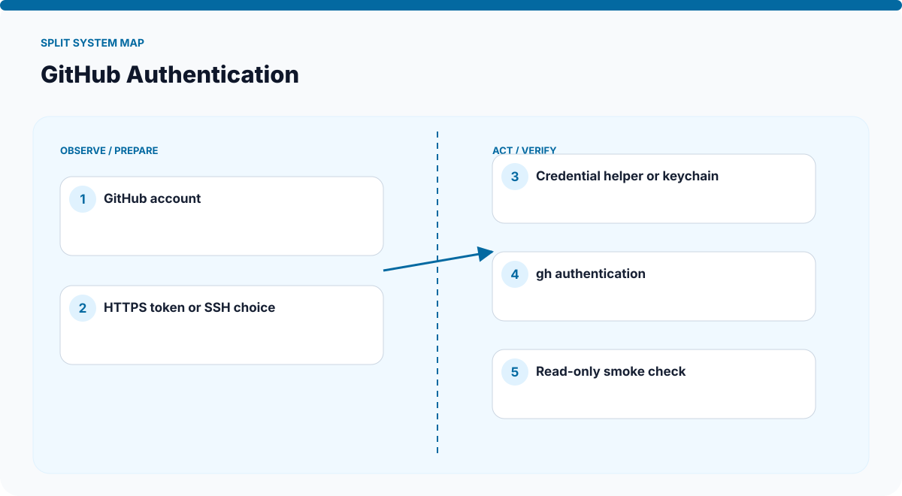
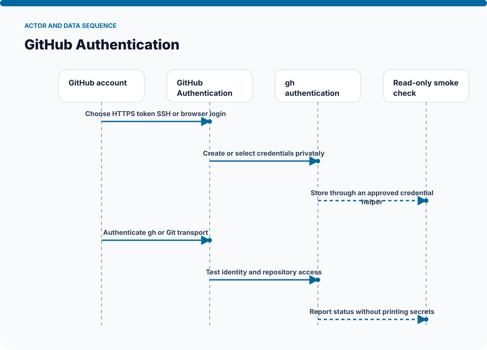
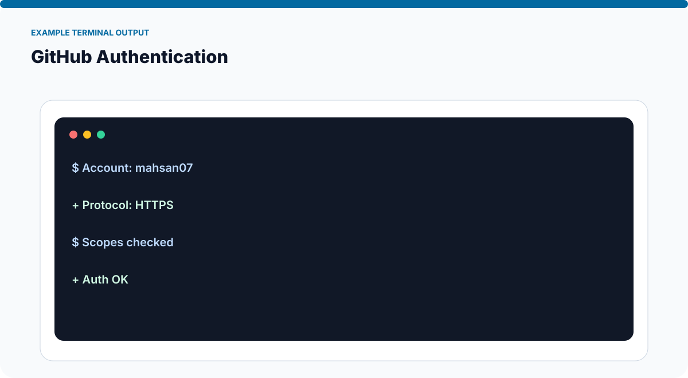
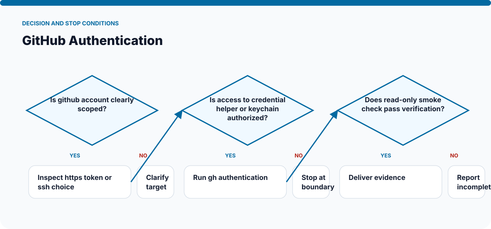

# How GitHub Authentication Works

The visuals on this page are static SVGs, so they render directly on GitHub on phones and desktop browsers. Each one is generated from a model specific to this skill.

## System architecture

### Components

- **1. GitHub account:** participates in choose https token ssh or browser login.
- **2. HTTPS token or SSH choice:** participates in create or select credentials privately.
- **3. Credential helper or keychain:** participates in store through an approved credential helper.
- **4. gh authentication:** participates in authenticate gh or git transport.
- **5. Read-only smoke check:** participates in test identity and repository access.

## Actor and data sequence

### 1. Choose HTTPS token SSH or browser login

**Primary surface:** `GitHub account`

Record the concrete input, the operation performed, and the evidence produced at this stage. Continue only when the output is sufficient for the next stage; otherwise preserve the blocker and stop.
### 2. Create or select credentials privately

**Primary surface:** `HTTPS token or SSH choice`

Record the concrete input, the operation performed, and the evidence produced at this stage. Continue only when the output is sufficient for the next stage; otherwise preserve the blocker and stop.
### 3. Store through an approved credential helper

**Primary surface:** `Credential helper or keychain`

Record the concrete input, the operation performed, and the evidence produced at this stage. Continue only when the output is sufficient for the next stage; otherwise preserve the blocker and stop.
### 4. Authenticate gh or Git transport

**Primary surface:** `gh authentication`

Record the concrete input, the operation performed, and the evidence produced at this stage. Continue only when the output is sufficient for the next stage; otherwise preserve the blocker and stop.
### 5. Test identity and repository access

**Primary surface:** `Read-only smoke check`

Record the concrete input, the operation performed, and the evidence produced at this stage. Continue only when the output is sufficient for the next stage; otherwise preserve the blocker and stop.
### 6. Report status without printing secrets

**Primary surface:** `GitHub account`

Record the concrete input, the operation performed, and the evidence produced at this stage. Continue only when the output is sufficient for the next stage; otherwise preserve the blocker and stop.

## Example output shape

The example is a visual contract: a real run may look different, but it should expose comparable state, provenance, and verification information. It is not presented as evidence of a live external action.

## Decision and stop conditions

The workflow stops when the target is ambiguous, the relevant surface is unavailable or unauthorized, or the final artifact cannot be checked. A logged-in session or successful tool call is not by itself proof that the requested outcome is complete.

## Verification checklist

- Confirm every component shown in the system map exists in the target environment.
- Trace the actor sequence using actual tool output or artifact state.
- Compare the result with the example-output information contract.
- Re-read or reopen the final artifact instead of trusting an attempt message.
- Report omitted stages, unsupported capabilities, and remaining human decisions.
