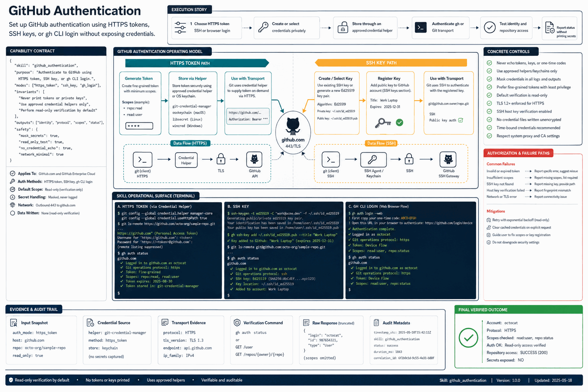

# How GitHub Authentication Works

Set up GitHub authentication using HTTPS tokens, SSH keys, or gh CLI login without exposing credentials.

## Stages

### 1. Choose HTTPS token SSH or browser login

**Primary surface:** `GitHub account`

Record the input, operation, observable output, and any decision that changes scope. Stop here if the output is missing, contradictory, or insufficient for the next stage.
### 2. Create or select credentials privately

**Primary surface:** `HTTPS token or SSH choice`

Record the input, operation, observable output, and any decision that changes scope. Stop here if the output is missing, contradictory, or insufficient for the next stage.
### 3. Store through an approved credential helper

**Primary surface:** `Credential helper or keychain`

Record the input, operation, observable output, and any decision that changes scope. Stop here if the output is missing, contradictory, or insufficient for the next stage.
### 4. Authenticate gh or Git transport

**Primary surface:** `gh authentication`

Record the input, operation, observable output, and any decision that changes scope. Stop here if the output is missing, contradictory, or insufficient for the next stage.
### 5. Test identity and repository access

**Primary surface:** `Read-only smoke check`

Record the input, operation, observable output, and any decision that changes scope. Stop here if the output is missing, contradictory, or insufficient for the next stage.
### 6. Report status without printing secrets

**Primary surface:** `Read-only smoke check`

Record the input, operation, observable output, and any decision that changes scope. Stop here if the output is missing, contradictory, or insufficient for the next stage.

## Failure handling

- **Authorization failure:** do not probe credentials or broaden access; report the missing authority.
- **Target ambiguity:** stop before mutation and request the minimum identifying information.
- **Tool or service failure:** retain error evidence, retry only safe transient failures, and cap retries.
- **Verification failure:** classify the run as incomplete even when the preceding operation returned success.

## Completion evidence

The handoff should contain the original request, inspection state, preview or plan, exact execution result, direct verification, and a final receipt naming limitations and withheld actions.
